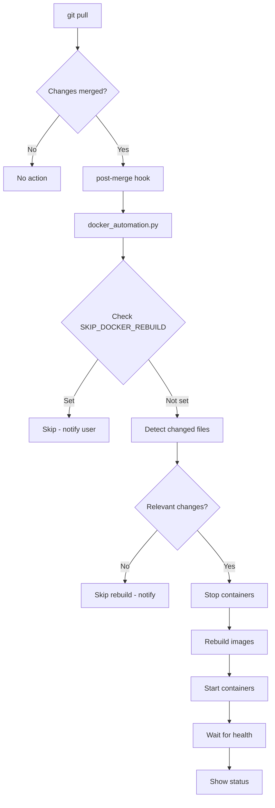

# Design Document: Git Pull Docker Automation

## Overview

This feature provides automated Docker container management triggered by Git pull operations. The solution consists of two components: a Git post-merge hook that detects when new changes are pulled, and an enhanced Python automation script that handles the container lifecycle (stop → rebuild → start).

The design leverages the existing `run_docker.py` and `setup_and_run_docker.py` scripts as a foundation, consolidating and extending their functionality into a single, more capable script.

## Architecture



## Components and Interfaces

### Component 1: Post-Merge Hook Script

**Location:** `.git/hooks/post-merge`

**Purpose:** Triggered automatically by Git after a successful merge (pull with changes). Invokes the automation script.

**Interface:**
```bash
#!/bin/bash
# Post-merge hook - runs after git pull with changes

echo "🔄 Git pull detected changes - checking if Docker rebuild needed..."

# Get the directory where the hook is located
REPO_ROOT="$(git rev-parse --show-toplevel)"

# Run the automation script
python "$REPO_ROOT/docker_automation.py" --post-merge

exit $?
```

### Component 2: Docker Automation Script

**Location:** `docker_automation.py` (project root)

**Purpose:** Central script for all Docker automation operations.

**Public Interface:**
```python
class DockerAutomation:
    def __init__(self, project_root: Path):
        """Initialize with project root directory"""
    
    def run(self, 
            mode: str = "auto",           # auto, rebuild, stop
            force: bool = False,          # Force rebuild even if no changes
            skip_pull: bool = False,      # Skip git pull
            post_merge: bool = False,     # Called from post-merge hook
            show_logs: bool = False       # Show logs after start
           ) -> bool:
        """Execute the automation workflow"""
    
    def install_hook(self) -> bool:
        """Install the post-merge Git hook"""
    
    def uninstall_hook(self) -> bool:
        """Remove the post-merge Git hook"""
    
    def get_changed_files(self) -> List[str]:
        """Get list of files changed in last merge"""
    
    def should_rebuild(self, changed_files: List[str]) -> bool:
        """Determine if rebuild is needed based on changed files"""
```

**CLI Interface:**
```
python docker_automation.py [OPTIONS]

Options:
  --rebuild         Force stop, rebuild, and start containers
  --stop            Stop all containers
  --logs            Show logs after starting
  --force           Force rebuild even if no relevant changes
  --skip-pull       Don't pull git changes (for manual triggers)
  --post-merge      Called from post-merge hook (internal use)
  --install-hook    Install the Git post-merge hook
  --uninstall-hook  Remove the Git post-merge hook
  --help            Show help message
```

### Component 3: Change Detection Module

**Purpose:** Analyzes changed files to determine if Docker rebuild is needed.

**Rebuild Trigger Patterns:**
```python
REBUILD_PATTERNS = [
    "backend/**",           # Any backend source changes
    "Dockerfile",           # Docker configuration
    "docker-compose.yml",   # Compose configuration
    "docker-compose.*.yml", # Any compose variant
    "pom.xml",              # Maven dependencies
    "backend/pom.xml",      # Backend Maven config
]

SKIP_PATTERNS = [
    "frontend/**",          # Frontend changes (separate build)
    "*.md",                 # Documentation
    "*.txt",                # Text files
    ".gitignore",           # Git config
    "script/**",            # Utility scripts
    "document/**",          # Documentation folder
]
```

## Data Models

### Configuration Model

```python
@dataclass
class AutomationConfig:
    """Configuration for the automation script"""
    project_root: Path
    docker_compose_file: Path = "docker-compose.yml"
    log_file: Path = "docker_automation.log"
    rebuild_patterns: List[str] = field(default_factory=lambda: REBUILD_PATTERNS)
    skip_patterns: List[str] = field(default_factory=lambda: SKIP_PATTERNS)
    health_check_timeout: int = 60  # seconds
    health_check_interval: int = 5  # seconds
```

### Operation Result Model

```python
@dataclass
class OperationResult:
    """Result of an automation operation"""
    success: bool
    message: str
    step: str  # Which step completed/failed
    duration: float  # Time taken in seconds
```


## Correctness Properties

*A property is a characteristic or behavior that should hold true across all valid executions of a system - essentially, a formal statement about what the system should do. Properties serve as the bridge between human-readable specifications and machine-verifiable correctness guarantees.*

### Property 1: Rebuild Pattern Matching

*For any* file path that matches a rebuild pattern (backend/**, Dockerfile, docker-compose.yml, pom.xml), the `should_rebuild` function SHALL return `true` when that file is in the changed files list.

**Validates: Requirements 2.1, 2.2**

### Property 2: Skip Pattern Exclusivity

*For any* set of changed files where ALL files match only skip patterns (frontend/**, *.md, document/**) and NONE match rebuild patterns, the `should_rebuild` function SHALL return `false`.

**Validates: Requirements 2.3**

### Property 3: Environment Variable Override

*For any* execution where the environment variable `SKIP_DOCKER_REBUILD` is set to "1", the automation SHALL skip the rebuild process regardless of changed files.

**Validates: Requirements 4.1**

### Property 4: Force Flag Override

*For any* execution with `force=True`, the automation SHALL trigger a rebuild regardless of whether changed files match rebuild patterns.

**Validates: Requirements 4.2**

## Error Handling

### Error Categories

1. **Git Errors**
   - Repository not found → Display error, exit with code 1
   - Git pull fails → Display error, continue with local code
   - Cannot determine changed files → Assume rebuild needed

2. **Docker Errors**
   - Docker not running → Display error with instructions, exit with code 1
   - Docker Compose not found → Display error with install instructions, exit with code 1
   - Container stop fails → Log warning, attempt rebuild anyway
   - Build fails → Display error with logs, exit with code 1
   - Start fails → Display error with logs, exit with code 1

3. **Hook Errors**
   - Cannot write to .git/hooks → Display permission error, exit with code 1
   - Hook already exists → Prompt user for confirmation

### Error Response Format

```python
def handle_error(step: str, error: Exception) -> None:
    """Standard error handling"""
    print(f"✗ Error during {step}: {error}")
    log_error(step, error)
    # Don't exit immediately - allow cleanup if needed
```

## Testing Strategy

### Unit Tests

Unit tests will verify specific examples and edge cases:

1. **Pattern Matching Tests**
   - Test specific file paths against rebuild patterns
   - Test edge cases like nested paths, similar names
   - Test empty file lists

2. **Hook Installation Tests**
   - Verify hook file creation
   - Verify hook content
   - Verify executable permissions

3. **Command Building Tests**
   - Verify correct docker-compose commands are built
   - Verify volume preservation (no -v flag)

### Property-Based Tests

Property-based tests will use `hypothesis` library to verify universal properties:

1. **Pattern Matching Property Test**
   - Generate random file paths matching rebuild patterns
   - Verify should_rebuild returns True for all

2. **Skip Pattern Property Test**
   - Generate random file sets with only skip-pattern files
   - Verify should_rebuild returns False for all

3. **Override Property Tests**
   - Test SKIP_DOCKER_REBUILD with various file combinations
   - Test --force flag with various file combinations

### Test Configuration

- Property-based tests: minimum 100 iterations
- Test framework: pytest with hypothesis
- Tag format: **Feature: git-pull-docker-automation, Property {number}: {property_text}**
